<div align="center">

# Home4U

**부동산 매물 거래 플랫폼**

공인중개사의 매물 관리부터 구매자의 검색·거래 요청·리뷰까지, 한 곳에서 처리되는 거래 진행 중심형 웹 서비스

[](https://github.com/GEONHO96/Home4U/actions/workflows/ci.yml)
[](https://openjdk.org/)
[](https://spring.io/projects/spring-boot)
[](https://spring.io/projects/spring-security)
[](https://react.dev/)
[](https://www.typescriptlang.org/)
[](https://vite.dev/)
[](#docker-배포)
[](https://www.h2database.com/)
[](https://www.mysql.com/)

</div>

---

## 목차

- [프로젝트 소개](#프로젝트-소개)
- [스크린샷](#스크린샷)
- [핵심 기능](#핵심-기능)
- [기술 스택](#기술-스택)
- [시스템 아키텍처](#시스템-아키텍처)
- [ERD](#erd-entity-relationship-diagram)
- [유스케이스 다이어그램](#유스케이스-다이어그램)
- [클래스 다이어그램](#클래스-다이어그램)
- [프로젝트 구조](#프로젝트-구조)
- [실행 방법](#실행-방법)
- [PWA](#pwa)
- [네이티브 앱 (Expo)](#네이티브-앱-expo)
- [소셜 로그인 설정](#소셜-로그인-설정)
- [Docker 배포](#docker-배포)
- [CI](#ci)
- [API 명세](#api-명세)
- [화면 구성](#화면-구성)
- [거래 상태 전이](#거래-상태-전이)
- [로드맵](#로드맵)

---

## 프로젝트 소개

부동산 매물 거래는 **매물 등록 → 검색 → 거래 요청 → 승인·거절 → 후기 공유**로 이어지는 다단계 흐름이지만, 기존 플랫폼들은 각 단계가 끊겨 있거나 중개사와 이용자가 다른 화면·다른 서비스를 써야 합니다.

**Home4U**는 이 흐름을 하나의 REST API + SPA로 엮습니다.

> - **공인중개사**는 매물을 등록하고 자신에게 들어온 거래 요청을 한 화면에서 승인/거절
> - **구매자**는 지역·거래유형·면적·층수·방구조로 매물을 필터링하고 상세에서 바로 거래 요청
> - 거래가 승인되면 **매물이 자동으로 "거래완료"로 전환**되고 목록에 배지가 붙음
> - 매물 상세 하단에 **별점 + 코멘트 기반 리뷰**로 거래 전 탐색 품질을 높임
> - **JWT 인증** · **BCrypt 해시** · 응답에서 `password` 필드 자동 차단
> - **H2 인메모리 기본 프로파일**로 DB 설치 없이 바로 실행, `mysql` 프로파일로 영속 운영

---

## 스크린샷

| 공개 화면 |  |
|:---------:|:-:|
| **홈** · 직방 톤 블루 CTA + 최근 본 매물 | **회원가입** · ROLE 선택 시 추가 필드 노출 |
| 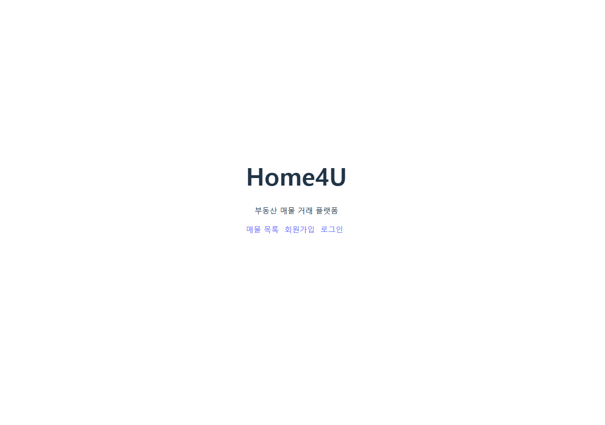 | 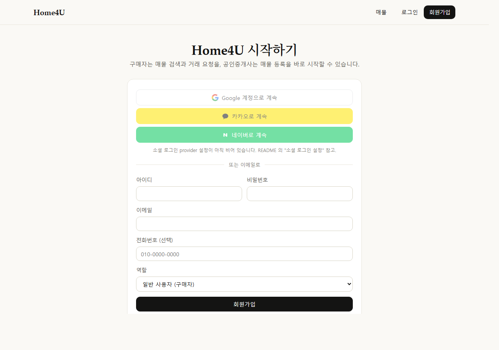 |
| **로그인** · 소셜 3종 + 이메일 폼 | **매물 목록** · 좌측 카드 리스트 + 우측 OSM 지도 + 가격 마커 |
| 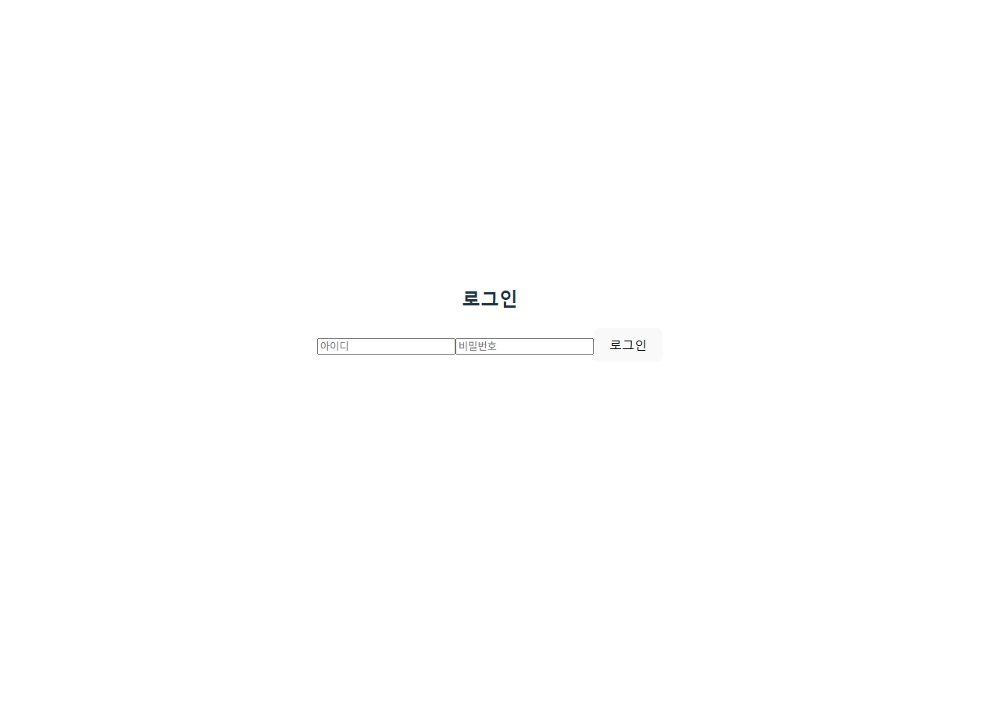 | 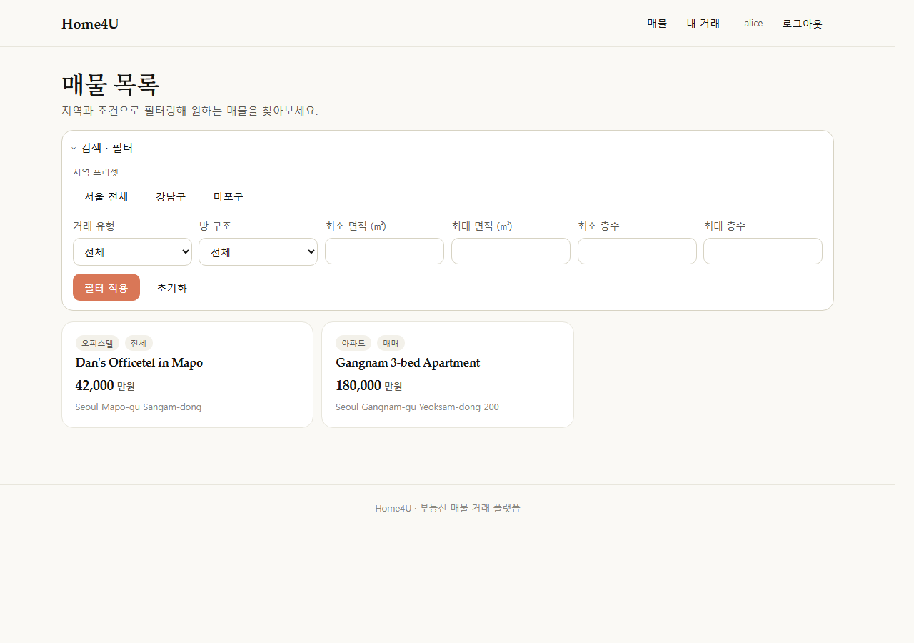 |

| 인증 후 화면 |  |
|:------------:|:-:|
| **매물 상세** · 이미지 · 가격 강조 · 찜 ♥ · 조회수 · 리뷰 | **매물 등록** (공인중개사) · 이미지 URL + 10+ 필드 |
| 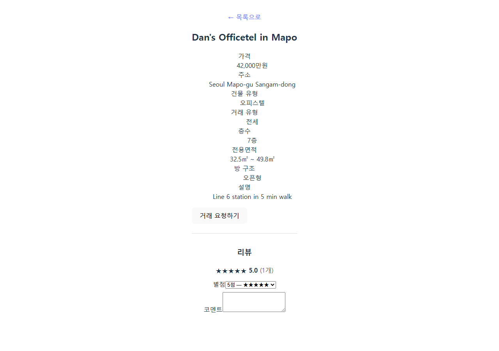 | 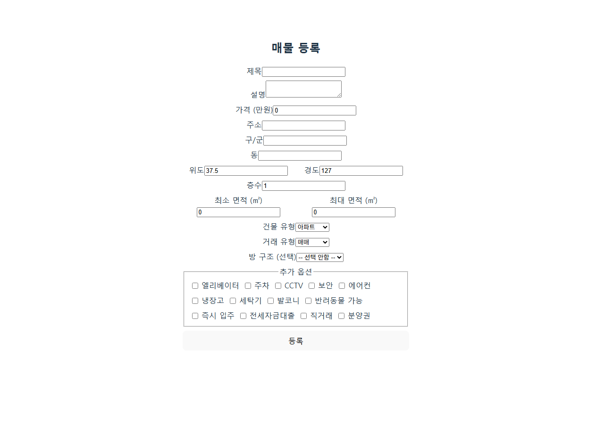 |
| **내 거래 내역 (판매자 탭)** · 승인/거절 | **찜한 매물** · 카드 그리드 |
| 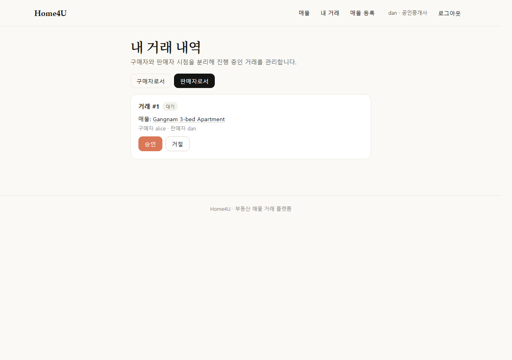 | 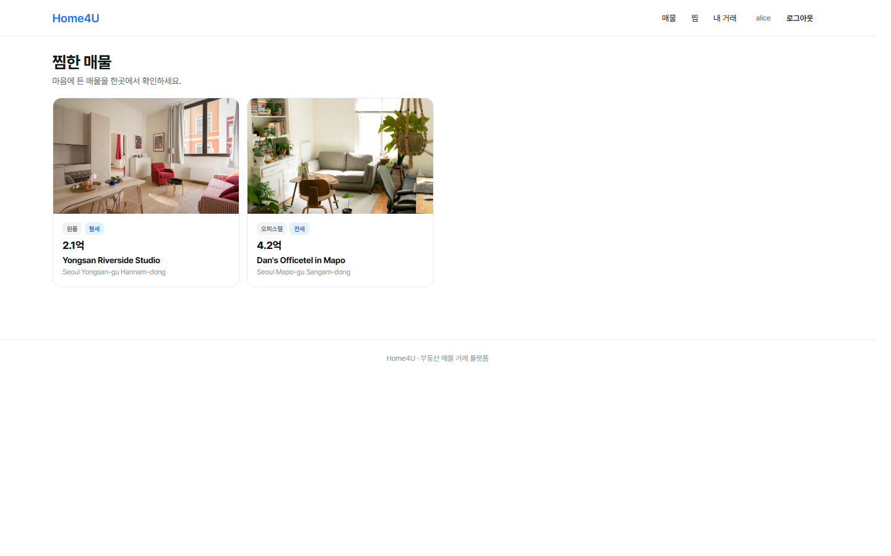 |
| **오프라인 페이지** · PWA 네트워크 실패 시 폴백 | **매물 상세 · 주변 시설 + 실거래가 차트** |
| 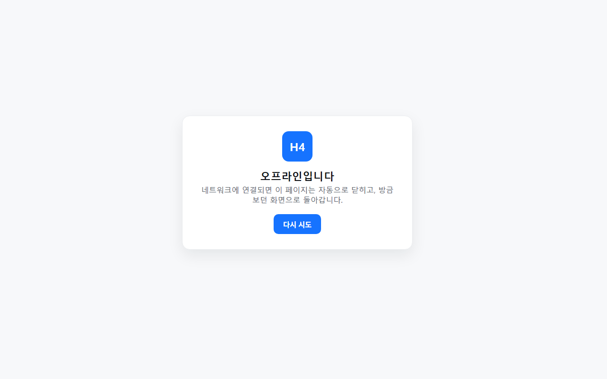 | 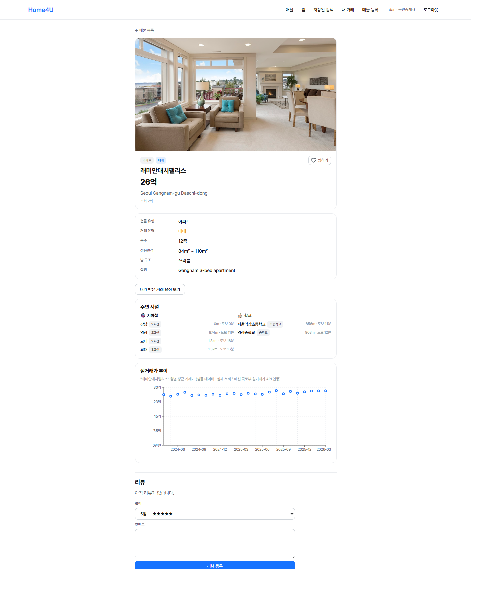 |
| **채팅 목록** · 상대 아바타 + 매물 태그 + 최근 시각 | **채팅방** · 버블 UI + 읽음 처리 + 5s 폴링 |
| 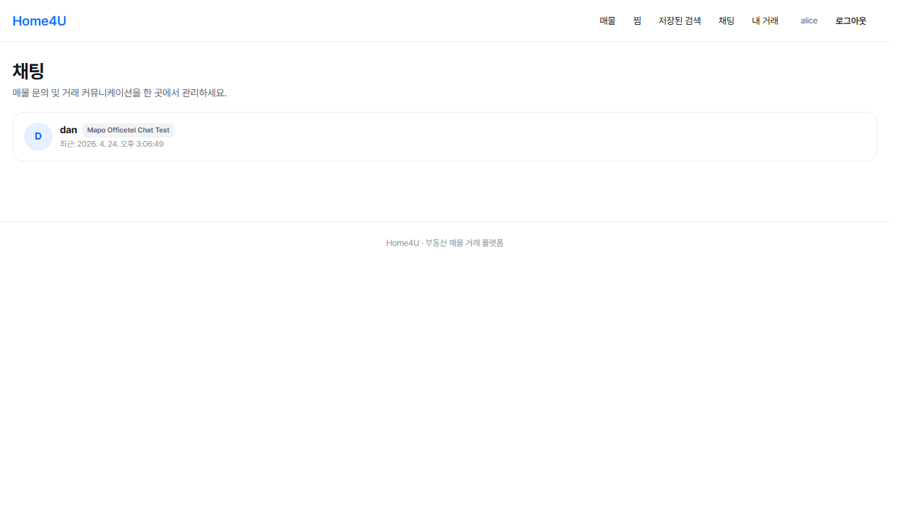 | 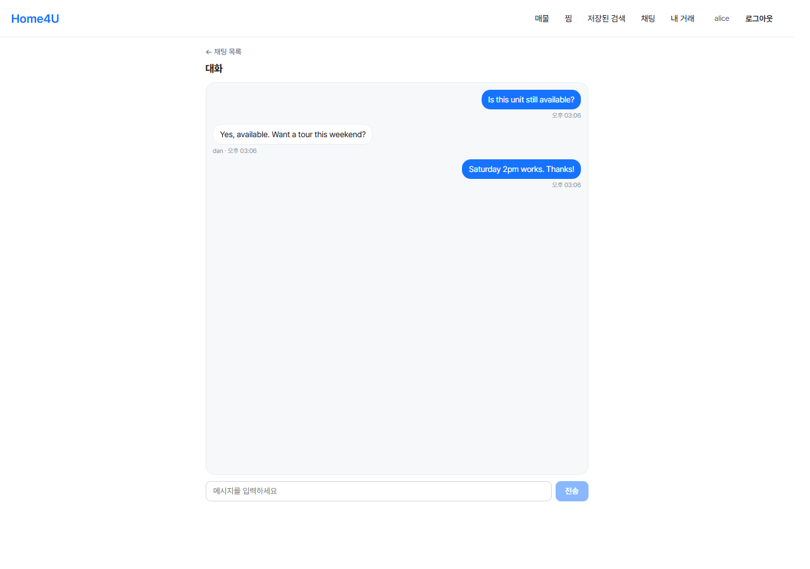 |
| **매물 상세 · 등록자 신뢰도 카드** · 평점 · 누적 찜 · 거래 완료율 · 응답 속도 중위값 | |
| 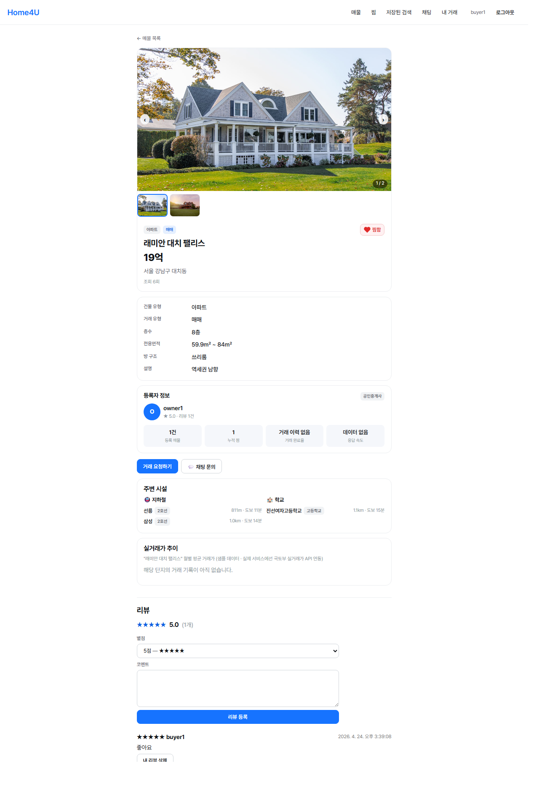 | |

> 스크린샷은 Windows Edge headless 로 자동 캡처합니다 (`docs/screenshots/`).  
> 재캡처 스크립트와 스크린샷용 bootstrap HTML (`public/screenshot-bootstrap.html`) 은 `docs/` 하위에서 확인하세요.

---

## 핵심 기능

### 공인중개사 (ROLE_REALTOR)

| 기능 | 설명 |
|:-----|:-----|
| 매물 등록 | 제목·설명·가격·주소·좌표·구/군/동·층수·면적(min~max)·건물유형·거래유형·방구조·추가 옵션을 한 폼에서 입력 |
| 거래 요청 관리 | "판매자" 탭에서 들어온 PENDING 거래를 한눈에 확인, 승인/거절을 단일 버튼으로 처리 |
| 자동 판매완료 전이 | 거래 승인 시 해당 매물의 `isSold` 가 자동으로 `true` 로 전환되어 목록에 [거래완료] 배지 노출 |

### 구매자 (ROLE_USER)

| 기능 | 설명 |
|:-----|:-----|
| 지도 + 리스트 이중 뷰 | 좌측 매물 카드 리스트 + 우측 OSM 지도. **가격 마커 클러스터링** · **드래그 후 "이 지역에서 검색"** 버튼 |
| 매물 목록·상세 | 이미지 갤러리(다중) + 가격 강조 + 거래유형·평형·층·방구조 등 핵심 스펙 + 조회수 + 주변 지하철/학교 + 실거래가 월별 추이 차트 + **채팅 문의 버튼** |
| **1:1 채팅** | 상세에서 "💬 채팅 문의" → 방 생성/재사용 후 `/chats/{id}` 이동. 내/상대 버블 UI, 읽음 처리, 5초 폴링으로 신규 메시지 갱신, `/chats` 에 전체 목록 |
| **등록자 신뢰도 카드** | 매물 상세에 "등록자 정보" 미니 카드. 누적 리뷰·평점 가중평균, 누적 찜 수, 거래 승인/완료율, 채팅 응답 속도 중위값 (분) 을 4-grid 로 집계 |
| 지역·필터 검색 | 지역 프리셋(서울/강남/마포) + 거래유형/방구조/면적/층수 필터 칩 + 키워드 검색 |
| **저장된 검색** | 필터 바의 "★ 조건 저장" 으로 등록, `/saved-searches` 에서 매칭되는 신규 매물 즉시 확인 |
| 거래 요청 | 상세 페이지에서 단일 버튼으로 PENDING 거래 생성, seller 는 매물 소유자로 자동 설정 |
| 찜하기 ♥ | 카드/상세에서 하트 토글, `/favorites` 에서 모아보기 |
| 최근 본 매물 | localStorage 기반, 홈 화면에서 방금 본 매물 이어보기 (최대 6개) |
| 리뷰 | 별점 1~5 + 코멘트, **본인만 수정/삭제** |
| 내 거래 내역 | 구매자/판매자 탭으로 시점 분리, 거래번호 · 매물 링크 · 상태 라벨 표시 |

### 공통

| 기능 | 설명 |
|:-----|:-----|
| JWT 인증 | 로그인 시 `{token, userId, username, role}` 발급, 이후 요청은 `Authorization: Bearer` |
| 역할 기반 UI | REALTOR 에게만 "+ 매물 등록" 노출, 자기 소유 매물에서는 "거래 요청" 대신 "받은 요청 보기" |
| 리뷰 평점 집계 | 매물 상세에서 평균 평점(별 + 소수점)과 리뷰 개수 실시간 집계 |
| 응답 민감 정보 차단 | `User.password` 에 `@JsonIgnore` 로 거래/리뷰 응답의 중첩 User 에서 해시 자동 제거 |
| 프로파일 분리 | 개발 기본값 = H2 in-memory (설치 불필요) / `SPRING_PROFILES_ACTIVE=mysql` 로 영속 전환 |

---

## 기술 스택

### Backend

| 기술 | 버전 | 용도 |
|:-----|:-----|:-----|
| Java | 17 | 언어 |
| Spring Boot | 3.4.1 | 웹 프레임워크 |
| Spring Security | 6.x | 인증/인가 (JWT 기반 stateless) |
| Spring Data JPA | 3.x | ORM |
| jjwt | 0.11.5 | JWT 발급/검증 |
| BCrypt | - | 비밀번호 해시 |
| H2 Database | - | 개발 인메모리 (기본 프로파일) |
| MySQL | 8 | 운영 DB (`mysql` 프로파일) |
| Jsoup | 1.15.3 | HTML 크롤링 |
| Apache Commons CSV | 1.9.0 | CSV 파싱 |
| Lombok | - | 보일러플레이트 제거 |
| JUnit 5 + Mockito | - | 단위 테스트 |

### Frontend

| 기술 | 버전 | 용도 |
|:-----|:-----|:-----|
| React | 19 | UI 라이브러리 |
| TypeScript | 5.7 | 타입 안전성 |
| Vite | 6 | 개발 서버 / 빌드 |
| React Router DOM | 7 | 클라이언트 라우팅 |
| Axios | 1.8 | HTTP 클라이언트 (JWT 자동 주입 인터셉터) |

### 도메인 모델 핵심 Enum

| Enum | 값 | 의미 |
|:-----|:---|:-----|
| `UserRole` | ROLE_USER, ROLE_REALTOR, ROLE_ADMIN | 사용자 역할 |
| `PropertyType` | APARTMENT, OFFICETEL, HOUSE, VILLA, STUDIO | 건물 유형 |
| `TransactionType` | SALE, JEONSE, MONTHLY_RENT, SHORT_TERM_RENT | 거래 유형 |
| `TransactionStatus` | PENDING, APPROVED, REJECTED, COMPLETED | 거래 진행 상태 |
| `RoomStructure` | OPEN_TYPE, SEPARATE_TYPE, TWO_ROOM, THREE_ROOM, DUPLEX | 방 구조 |
| `AdditionalOption` | ELEVATOR, PARKING, CCTV, SECURITY, AIR_CONDITIONER ... (총 13종) | 추가 옵션 |

---

## 시스템 아키텍처

```mermaid
flowchart TB
    subgraph Client["🖥️ Client"]
        FE["<b>Frontend</b><br/>React 19 · TypeScript<br/>Vite · React Router · Axios<br/><code>:5173</code>"]
    end

    subgraph Backend["⚙️ Backend  :8080"]
        direction TB
        SEC["🔐 Spring Security<br/>JWT Filter · BCrypt"]
        CTR["🎯 Controller Layer<br/>매물 · 거래 · 리뷰 · 사용자"]
        SVC["📦 Service Layer<br/>비즈니스 규칙 · 상태 전이"]
        REPO["💾 Repository Layer<br/>Spring Data JPA · JPQL"]
    end

    subgraph Data["🗄️ Database"]
        H2[("H2 In-Memory<br/>dev 프로파일 기본")]
        MY[("MySQL 8<br/>mysql 프로파일")]
    end

    subgraph Ext["🌐 External (선택)"]
        NAVER["Naver Map Geocoding"]
        OAUTH["OAuth 2.0<br/>Google · Kakao · Naver"]
        CHAT["Chatbot · Crawler"]
    end

    FE -- "REST API / JSON" --> SEC
    SEC --> CTR --> SVC --> REPO
    REPO --> H2
    REPO --> MY
    SVC -. "ENV 키 설정 시" .-> NAVER
    SVC -. "" .-> OAUTH
    SVC -. "" .-> CHAT
```

---

## ERD (Entity Relationship Diagram)

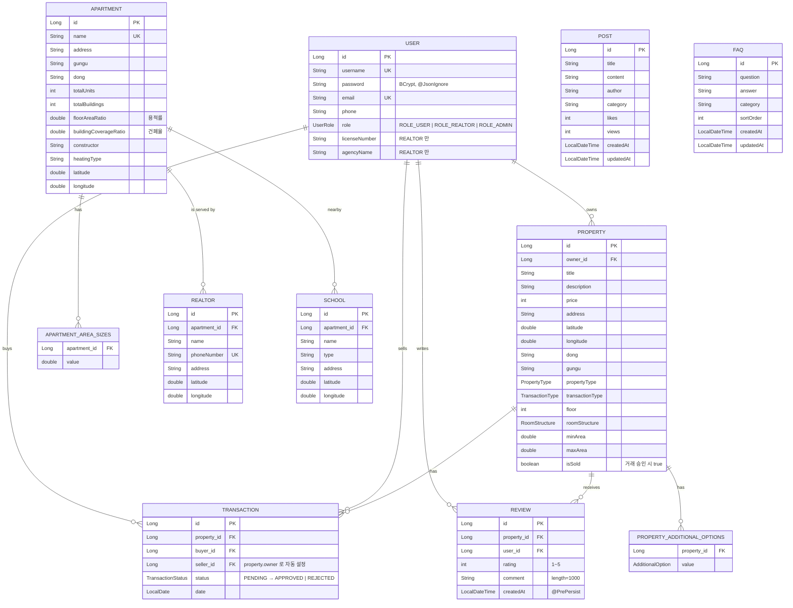
```mermaid
erDiagram
    USER {
        Long id PK
        String username UK
        String password "BCrypt, @JsonIgnore"
        String email UK
        String phone
        UserRole role "ROLE_USER | ROLE_REALTOR | ROLE_ADMIN"
        String licenseNumber "REALTOR 만"
        String agencyName "REALTOR 만"
    }

    PROPERTY {
        Long id PK
        Long owner_id FK
        String title
        String description
        int price
        String address
        double latitude
        double longitude
        String dong
        String gungu
        PropertyType propertyType
        TransactionType transactionType
        int floor
        RoomStructure roomStructure
        double minArea
        double maxArea
        boolean isSold "거래 승인 시 true"
    }

    PROPERTY_ADDITIONAL_OPTIONS {
        Long property_id FK
        AdditionalOption value
    }

    TRANSACTION {
        Long id PK
        Long property_id FK
        Long buyer_id FK
        Long seller_id FK "property.owner 로 자동 설정"
        TransactionStatus status "PENDING → APPROVED | REJECTED"
        LocalDate date
    }

    REVIEW {
        Long id PK
        Long property_id FK
        Long user_id FK
        int rating "1~5"
        String comment "length=1000"
        LocalDateTime createdAt "@PrePersist"
    }

    APARTMENT {
        Long id PK
        String name UK
        String address
        String gungu
        String dong
        int totalUnits
        int totalBuildings
        double floorAreaRatio "용적률"
        double buildingCoverageRatio "건폐율"
        String constructor
        String heatingType
        double latitude
        double longitude
    }

    APARTMENT_AREA_SIZES {
        Long apartment_id FK
        double value
    }

    REALTOR {
        Long id PK
        Long apartment_id FK
        String name
        String phoneNumber UK
        String address
        double latitude
        double longitude
    }

    SCHOOL {
        Long id PK
        Long apartment_id FK
        String name
        String type
        String address
        double latitude
        double longitude
    }

    POST {
        Long id PK
        String title
        String content
        String author
        String category
        int likes
        int views
        LocalDateTime createdAt
        LocalDateTime updatedAt
    }

    FAQ {
        Long id PK
        String question
        String answer
        String category
        int sortOrder
        LocalDateTime createdAt
        LocalDateTime updatedAt
    }

    USER ||--o{ PROPERTY : "owns"
    USER ||--o{ TRANSACTION : "buys"
    USER ||--o{ TRANSACTION : "sells"
    USER ||--o{ REVIEW : "writes"
    PROPERTY ||--o{ TRANSACTION : "has"
    PROPERTY ||--o{ REVIEW : "receives"
    PROPERTY ||--o{ PROPERTY_ADDITIONAL_OPTIONS : "has"
    APARTMENT ||--o{ REALTOR : "is served by"
    APARTMENT ||--o{ SCHOOL : "nearby"
    APARTMENT ||--o{ APARTMENT_AREA_SIZES : "has"
```

---

## 유스케이스 다이어그램

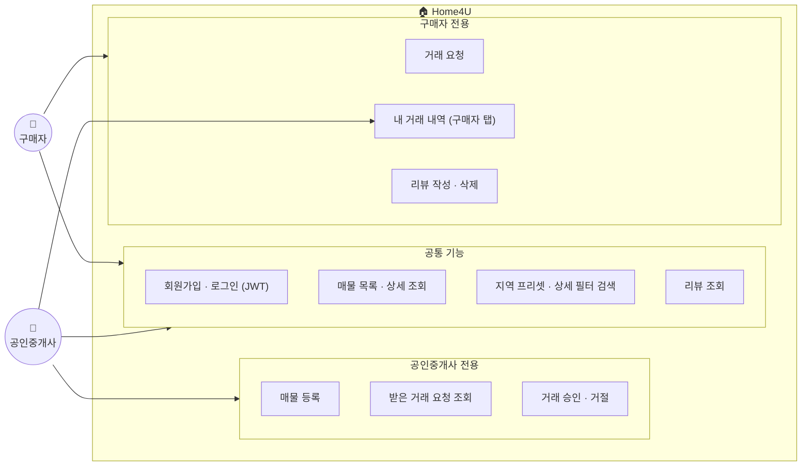
```mermaid
flowchart LR
    R(("🏢<br/>공인중개사"))

    subgraph System["🏠 Home4U"]
        direction TB

        subgraph ROnly["공인중개사 전용"]
            R1["매물 등록"]
            R2["받은 거래 요청 조회"]
            R3["거래 승인 · 거절"]
        end

        subgraph Common["공통 기능"]
            C1["회원가입 · 로그인 (JWT)"]
            C2["매물 목록 · 상세 조회"]
            C3["지역 프리셋 · 상세 필터 검색"]
            C4["리뷰 조회"]
        end

        subgraph UOnly["구매자 전용"]
            U1["거래 요청"]
            U2["내 거래 내역 (구매자 탭)"]
            U3["리뷰 작성 · 삭제"]
        end
    end

    U(("👤<br/>구매자"))

    R --> ROnly
    R --> Common
    R --> U2
    U --> Common
    U --> UOnly
```

---

## 클래스 다이어그램

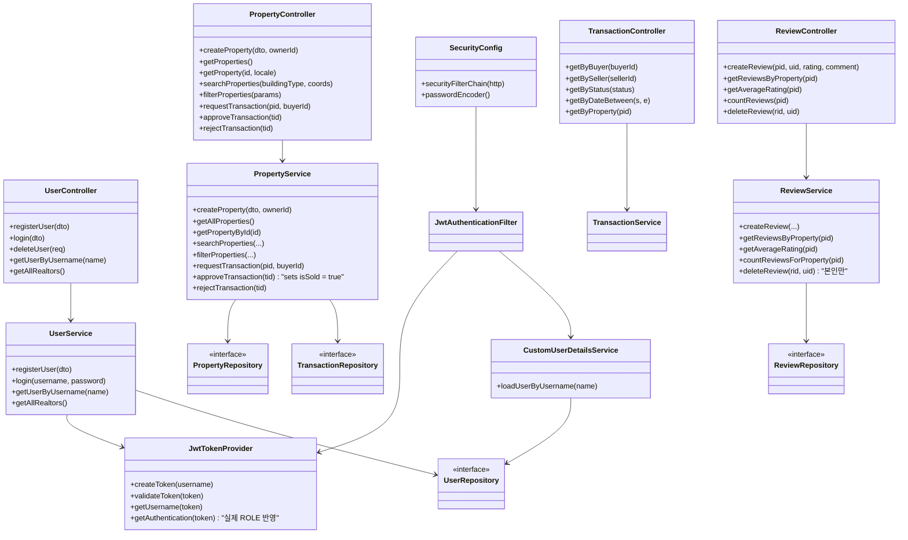
```mermaid
classDiagram
    direction TB

    class UserController {
        +registerUser(dto)
        +login(dto)
        +deleteUser(req)
        +getUserByUsername(name)
        +getAllRealtors()
    }

    class PropertyController {
        +createProperty(dto, ownerId)
        +getProperties()
        +getProperty(id, locale)
        +searchProperties(buildingType, coords)
        +filterProperties(params)
        +requestTransaction(pid, buyerId)
        +approveTransaction(tid)
        +rejectTransaction(tid)
    }

    class TransactionController {
        +getByBuyer(buyerId)
        +getBySeller(sellerId)
        +getByStatus(status)
        +getByDateBetween(s, e)
        +getByProperty(pid)
    }

    class ReviewController {
        +createReview(pid, uid, rating, comment)
        +getReviewsByProperty(pid)
        +getAverageRating(pid)
        +countReviews(pid)
        +deleteReview(rid, uid)
    }

    class UserService {
        +registerUser(dto)
        +login(username, password)
        +getUserByUsername(name)
        +getAllRealtors()
    }

    class PropertyService {
        +createProperty(dto, ownerId)
        +getAllProperties()
        +getPropertyById(id)
        +searchProperties(...)
        +filterProperties(...)
        +requestTransaction(pid, buyerId)
        +approveTransaction(tid) "sets isSold = true"
        +rejectTransaction(tid)
    }

    class ReviewService {
        +createReview(...)
        +getReviewsByProperty(pid)
        +getAverageRating(pid)
        +countReviewsForProperty(pid)
        +deleteReview(rid, uid) "본인만"
    }

    class JwtTokenProvider {
        +createToken(username)
        +validateToken(token)
        +getUsername(token)
        +getAuthentication(token) "실제 ROLE 반영"
    }

    class CustomUserDetailsService {
        +loadUserByUsername(name)
    }

    class SecurityConfig {
        +securityFilterChain(http)
        +passwordEncoder()
    }

    UserController --> UserService
    PropertyController --> PropertyService
    TransactionController --> TransactionService
    ReviewController --> ReviewService
    UserService --> JwtTokenProvider
    UserService --> UserRepository
    PropertyService --> PropertyRepository
    PropertyService --> TransactionRepository
    ReviewService --> ReviewRepository
    SecurityConfig --> JwtAuthenticationFilter
    JwtAuthenticationFilter --> JwtTokenProvider
    JwtAuthenticationFilter --> CustomUserDetailsService
    CustomUserDetailsService --> UserRepository

    class TransactionService
    class UserRepository
    class PropertyRepository
    class TransactionRepository
    class ReviewRepository
    class JwtAuthenticationFilter
    <<interface>> UserRepository
    <<interface>> PropertyRepository
    <<interface>> TransactionRepository
    <<interface>> ReviewRepository
```

---

## 프로젝트 구조

```
Home4U/
├── README.md
├── qodana.yaml
│
├── Home4u-backend/
│   ├── build.gradle
│   ├── .env.example
│   └── src/
│       ├── main/java/com/piko/home4u/
│       │   ├── Home4UApplication.java
│       │   ├── config/          # Security / CORS / Message / RestTemplate
│       │   ├── controller/      # REST 컨트롤러 13개
│       │   ├── dto/             # 요청 / 응답 DTO
│       │   ├── model/           # 엔티티 + Enum
│       │   ├── repository/      # Spring Data JPA 레포지토리 9개
│       │   ├── security/        # JwtTokenProvider / JwtAuthenticationFilter / CustomUserDetailsService
│       │   ├── service/         # 서비스 14개
│       │   ├── crawler/         # 부동산 목록 크롤러 (Jsoup)
│       │   └── scraper dto
│       ├── main/resources/
│       │   ├── application.properties        # 공통 + JWT/OAuth 환경변수 연결
│       │   ├── application-dev.properties    # H2 인메모리 (기본)
│       │   ├── application-mysql.properties  # MySQL 프로파일
│       │   └── i18n/
│       └── test/java/com/piko/home4u/
│           └── Home4UTests.java              # 6 tests · MockMvc + Mockito
│
└── Home4u-frontend/
    ├── package.json
    ├── vite.config.ts
    ├── tsconfig.app.json
    └── src/
        ├── main.tsx                # BrowserRouter 래핑
        ├── App.tsx                 # 라우트 정의 + 홈 네비
        ├── api/
        │   ├── axiosInstance.js    # baseURL + JWT 인터셉터
        │   ├── userApi.js
        │   ├── propertyApi.ts      # getAll / byId / create / search / filter
        │   ├── transactionApi.ts   # request / approve / reject / byBuyer / bySeller
        │   └── reviewApi.ts
        ├── components/
        │   └── ReviewSection.tsx
        ├── pages/
        │   ├── LoginPage.jsx
        │   ├── RegisterPage.jsx
        │   ├── PropertyListPage.tsx    # 필터 · 지역 프리셋
        │   ├── PropertyDetailPage.tsx  # 상세 + 거래 요청 + 리뷰
        │   ├── PropertyCreatePage.tsx  # REALTOR 전용 등록 폼
        │   └── TransactionsPage.tsx    # 구매자 / 판매자 탭
        └── types/
            ├── property.ts
            ├── transaction.ts
            └── review.ts
```

---

## 실행 방법

### 사전 요구사항

- Java 17+
- Node.js 18+
- MySQL 8 **(선택)** — 없으면 H2 in-memory 로 자동 실행

### 로컬 개발 환경 (H2 인메모리 - DB 설치 불필요)

```bash
# 1. 저장소 클론
git clone https://github.com/GEONHO96/Home4U.git
cd Home4U

# 2. 백엔드 실행 (H2 인메모리, 기본 프로파일 = dev)
cd Home4u-backend
./gradlew bootRun

# 3. 프론트엔드 실행 (새 터미널)
cd Home4u-frontend
npm install
npm run dev
```

| 서비스 | URL |
|:-------|:----|
| 프론트엔드 (Vite dev) | http://localhost:5173 |
| 백엔드 API | http://localhost:8080 |
| H2 Console | http://localhost:8080/h2-console |

H2 콘솔 접속 시 JDBC URL: `jdbc:h2:mem:home4u`, User: `sa`, Password: (빈칸)

### MySQL 프로파일로 실행

```bash
# 1. DB 생성
mysql -u root -p
CREATE DATABASE home4u CHARACTER SET utf8mb4 COLLATE utf8mb4_unicode_ci;

# 2. 환경변수 설정
export SPRING_PROFILES_ACTIVE=mysql
export MYSQL_USER=root
export MYSQL_PASSWORD=<your-password>

# 3. 실행
./gradlew bootRun
```

### 환경변수

`Home4u-backend/.env.example` 을 복사해 `.env` 로 만들고 필요한 키만 채워 쓰세요 (`.gitignore` 등록됨).

| 변수 | 용도 | 필수 |
|:-----|:-----|:-----|
| `JWT_SECRET` | JWT 서명 시크릿 (256bit+) | 운영 필수 (dev 에서는 기본값) |
| `SPRING_PROFILES_ACTIVE` | `dev` (H2) / `mysql` | 선택 |
| `MYSQL_USER` / `MYSQL_PASSWORD` | MySQL 프로파일 전용 | `mysql` 프로파일일 때 필수 |
| `NAVER_CLIENT_ID` / `NAVER_CLIENT_SECRET` | 네이버 지도 지오코딩 / (구) OAuth 호환 키 | 선택 |
| `OAUTH_GOOGLE_CLIENT_ID` / `OAUTH_GOOGLE_CLIENT_SECRET` / `OAUTH_GOOGLE_REDIRECT_URI` | Google 소셜 로그인 | 선택 |
| `OAUTH_KAKAO_CLIENT_ID` / `OAUTH_KAKAO_CLIENT_SECRET` / `OAUTH_KAKAO_REDIRECT_URI` | Kakao 소셜 로그인 | 선택 |
| `OAUTH_NAVER_CLIENT_ID` / `OAUTH_NAVER_CLIENT_SECRET` / `OAUTH_NAVER_REDIRECT_URI` | Naver 소셜 로그인 | 선택 |
| `OPENAI_API_KEY` | 챗봇 | 선택 |

---

## PWA

`Home4u-frontend` 는 **Progressive Web App** 으로 빌드됩니다. 모바일 브라우저에서
"홈 화면에 추가" 로 설치하면 독립 앱처럼 실행되고, 오프라인 상태에서도 최근에 본
화면이 동작합니다.

### 포함된 것

| 항목 | 내용 |
|:---|:---|
| `manifest.webmanifest` | name/short_name, theme_color `#1673ff`, display=standalone, 아이콘 192/512 + maskable |
| Service Worker (Workbox) | vite-plugin-pwa 가 `generateSW` 모드로 자동 생성 · `registerType: autoUpdate` |
| 런타임 캐시 | Pretendard CDN `CacheFirst` (30일), Unsplash 이미지 `StaleWhileRevalidate`, OSM 타일 `StaleWhileRevalidate` (7일) |
| 오프라인 폴백 | 네트워크 실패 시 `offline.html` 을 표시 (로고 + "다시 시도" + `online` 이벤트 자동 리로드) |
| 설치 유도 배너 | `InstallPrompt` 컴포넌트가 `beforeinstallprompt` 이벤트를 캡처해 하단 시트로 노출, "나중에" 는 localStorage 로 재표시 차단 |
| 아이콘 | `Home4u-frontend/public/icons/` (Edge headless 로 SVG → PNG 자동 생성) |

### 설치 확인

```bash
cd Home4u-frontend
npm run build
npm run preview       # :4173 에서 prod 서빙
```

브라우저 주소창 오른쪽 "앱 설치" 아이콘이 보이면 OK. Lighthouse PWA 카테고리에서 Installable 체크.

---

## 네이티브 앱 (Expo)

`home4u-app/` 디렉토리에 **React Native + Expo** 앱이 포함됩니다.
기존 Spring Boot 백엔드를 그대로 사용하며, 로그인 / 매물 목록 / 상세 3화면으로 구성된 MVP 입니다.

### 기술 스택
- Expo SDK 52 · React Native 0.76 · TypeScript
- React Navigation (Native Stack)
- Axios (`src/api.ts` 에서 baseURL 과 Bearer 토큰 자동 주입)

### 빠른 실행

```bash
cd home4u-app
npm install
npm start          # Metro 서버 + QR 코드
```

휴대폰에 **Expo Go** 앱을 설치하고 QR 스캔하면 즉시 실행됩니다.

| 플랫폼 | 명령 | 비고 |
|:---|:---|:---|
| Android 에뮬레이터 | `npm run android` | `10.0.2.2:8080` 이 호스트 백엔드 |
| iOS 시뮬레이터 | `npm run ios` | macOS + Xcode 필요 |
| 브라우저 (제한적) | `npm run web` | react-native-web 기반 |
| 클라우드 빌드 | `eas build --platform {android\|ios}` | Windows 에서도 iOS IPA 빌드 가능 (Apple 개발자 계정 필요) |

### Base URL 조정

실기기에서 LAN 으로 연결할 때는 `home4u-app/app.json` 의 `expo.extra.apiBaseUrl` 을
PC LAN IP (`http://192.168.x.x:8080`) 로 교체하세요.

### 디렉토리

```
home4u-app/
├── App.tsx                 # NavigationContainer + Stack
├── app.json                # Expo 메타 · extra.apiBaseUrl
├── assets/icon.png         # 공용 아이콘 (웹 PWA 와 동일 소스)
└── src/
    ├── api.ts              # axios + 엔드포인트 + 가격 포매터
    └── screens/
        ├── LoginScreen.tsx
        ├── PropertyListScreen.tsx
        └── PropertyDetailScreen.tsx
```

---

## 소셜 로그인 설정

Google / Kakao / Naver 세 공급자를 지원합니다. 환경변수가 비어있으면 해당 버튼은 **"미설정"으로 비활성** 되며, 나머지 기본 로그인·가입 기능은 정상 동작합니다.

### 작동 원리

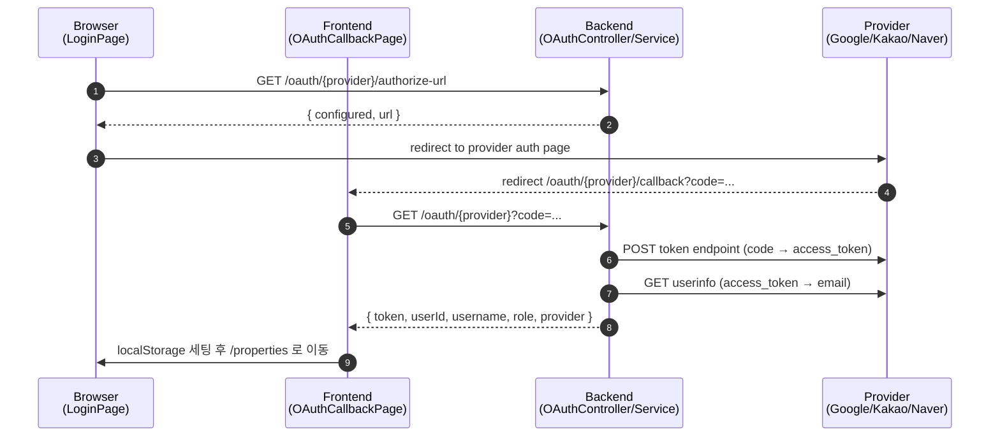
```mermaid
sequenceDiagram
    autonumber
    participant U as Browser<br/>(LoginPage)
    participant F as Frontend<br/>(OAuthCallbackPage)
    participant B as Backend<br/>(OAuthController/Service)
    participant P as Provider<br/>(Google/Kakao/Naver)

    U->>B: GET /oauth/{provider}/authorize-url
    B-->>U: { configured, url }
    U->>P: redirect to provider auth page
    P-->>F: redirect /oauth/{provider}/callback?code=...
    F->>B: GET /oauth/{provider}?code=...
    B->>P: POST token endpoint (code → access_token)
    B->>P: GET userinfo (access_token → email)
    B-->>F: { token, userId, username, role, provider }
    F->>U: localStorage 세팅 후 /properties 로 이동
```

### provider 별 콘솔 설정

<details>
<summary><b>Google</b></summary>

1. [Google Cloud Console](https://console.cloud.google.com/) → APIs & Services → Credentials → OAuth 2.0 Client IDs
2. Application type: **Web application**
3. Authorized redirect URI: `http://localhost:5173/oauth/google/callback` (운영 도메인이면 해당 값 추가)
4. Client ID / Client Secret 을 환경변수에 주입
```bash
export OAUTH_GOOGLE_CLIENT_ID=xxx.apps.googleusercontent.com
export OAUTH_GOOGLE_CLIENT_SECRET=xxx
export OAUTH_GOOGLE_REDIRECT_URI=http://localhost:5173/oauth/google/callback
```

</details>

<details>
<summary><b>Kakao</b></summary>

1. [Kakao Developers](https://developers.kakao.com/) → 내 애플리케이션 → 앱 추가
2. 제품 설정 → **카카오 로그인** → 활성화 → Redirect URI 등록: `http://localhost:5173/oauth/kakao/callback`
3. 동의항목에서 **카카오계정(이메일)** 을 선택동의로 체크
4. 앱 설정 → 요약 정보의 **REST API 키** 를 `OAUTH_KAKAO_CLIENT_ID` 로, 보안의 Client Secret(선택) 을 `OAUTH_KAKAO_CLIENT_SECRET` 로 설정

```bash
export OAUTH_KAKAO_CLIENT_ID=xxx
export OAUTH_KAKAO_CLIENT_SECRET=xxx   # 선택
export OAUTH_KAKAO_REDIRECT_URI=http://localhost:5173/oauth/kakao/callback
```

> 이메일 동의를 거절한 사용자는 `kakao_{id}@home4u.local` 형식의 임시 이메일로 계정이 생성됩니다.

</details>

<details>
<summary><b>Naver</b></summary>

1. [NAVER Developers](https://developers.naver.com/) → 애플리케이션 등록
2. 사용 API: **네이버 로그인**, 권한: **회원이름·이메일주소** 필수 체크
3. Callback URL: `http://localhost:5173/oauth/naver/callback`
4. 발급된 Client ID / Secret 을 환경변수에 주입

```bash
export OAUTH_NAVER_CLIENT_ID=xxx
export OAUTH_NAVER_CLIENT_SECRET=xxx
export OAUTH_NAVER_REDIRECT_URI=http://localhost:5173/oauth/naver/callback
```

</details>

### 동작 확인

- 백엔드 재기동 → 프론트엔드 `/login` 접속
- 각 provider 버튼이 **활성화** 상태로 노출되면 설정 OK (미설정이면 흐릿하게 + 안내문 표시)
- 버튼 클릭 → provider 동의 화면 → `/oauth/{provider}/callback` 으로 자동 리디렉션 → localStorage 저장 → `/properties` 이동

---

## Docker 배포

저장소 루트의 `docker-compose.yml` 하나로 **MySQL + Backend + Frontend(nginx)** 스택을 동시에 기동할 수 있습니다.

### 빠른 실행

```bash
# 1. (선택) 환경변수 오버라이드
export JWT_SECRET=$(openssl rand -hex 32)
export MYSQL_PASSWORD=changeme
# export NAVER_CLIENT_ID=... / NAVER_CLIENT_SECRET=... / OPENAI_API_KEY=...

# 2. 전체 스택 빌드 + 기동
docker-compose up --build

# 3. 접속
# - Frontend : http://localhost:8081
# - Backend  : http://localhost:8080
# - MySQL    : localhost:3306 (home4u / ${MYSQL_USER:-home4u} / ${MYSQL_PASSWORD})
```

### 컨테이너 구성

| 서비스 | 이미지 | 포트 | 특징 |
|:-------|:-------|:-----|:-----|
| `mysql` | `mysql:8.0` | 3306 | `home4u` DB 자동 생성, `mysqladmin ping` healthcheck, 볼륨 `mysql_data` 영속화 |
| `backend` | `Home4u-backend/Dockerfile` (multi-stage: Gradle → JRE 17 Alpine) | 8080 | `SPRING_PROFILES_ACTIVE=mysql`, MySQL healthy 대기 후 기동, 비루트 유저로 실행 |
| `frontend` | `Home4u-frontend/Dockerfile` (multi-stage: Vite build → nginx 1.27 Alpine) | 8081 → 80 | SPA fallback (`try_files $uri /index.html`), 정적자원 30일 캐시, gzip |

### 개별 이미지 빌드 / 실행

```bash
# 백엔드만
docker build -t home4u-backend ./Home4u-backend
docker run --rm -p 8080:8080 \
  -e JWT_SECRET=$(openssl rand -hex 32) \
  -e SPRING_PROFILES_ACTIVE=dev \
  home4u-backend

# 프론트엔드만 (미리 빌드된 dist 를 nginx 로 서빙)
docker build -t home4u-frontend ./Home4u-frontend
docker run --rm -p 8081:80 home4u-frontend
```

### 운영 체크리스트

- `JWT_SECRET` 는 **32바이트 이상 랜덤** 으로 오버라이드 (개발 기본값 금지)
- MySQL 비밀번호는 `MYSQL_PASSWORD` / `MYSQL_ROOT_PASSWORD` 로 반드시 교체
- 프론트엔드는 런타임에 `http://localhost:8080` 을 직접 호출 — 같은 도메인에서 서비스하려면 `Home4u-frontend/src/api/axiosInstance.js` 의 `baseURL` 을 `/api` 로 바꾸고 `nginx.conf` 의 주석 처리된 `location /api/` 프록시를 활성화
- 뒤 단에 HTTPS/Traefik/CloudFront 등을 둘 경우 CORS 허용 오리진을 `application.properties` 의 `cors.allowed-origins` 로 좁힐 것

---

## CI

`.github/workflows/ci.yml` 이 push · PR 에서 두 개의 job 을 돌립니다.

| Job | 내용 | 부가 산출물 |
|:----|:-----|:----|
| `backend-test` | JDK 17 · Gradle · H2 in-memory · `./gradlew test` (컨트롤러 25 · 서비스 단위 55 · 유틸 3 = **83 tests**) | `Home4u-backend/build/reports/tests/test` (artifact: `backend-test-report`) |
| `frontend-build` | Node 20 · `npm ci` · `npm run build` (tsc + vite) | `Home4u-frontend/dist` (artifact: `frontend-dist`) |

상단의 CI 뱃지가 **최신 main 빌드 상태**를 실시간으로 반영합니다. 실패 시 Actions 탭에서 원인 로그를 바로 확인할 수 있습니다.

---

## API 명세

> **공통 응답**: 성공 시 엔티티/DTO 본문, 실패 시 `{ "message": "..." }`  
> **인증 헤더**: `Authorization: Bearer <JWT>` (공개 API 제외)  
> 모든 경로는 `http://localhost:8080` 기준

### 엔드포인트 요약

| 카테고리 | 수 | 주요 경로 |
|:---------|:---|:---------|
| 사용자 | 11 | 회원가입, 로그인, 탈퇴, 검색, 중개업자 목록, 내 매물, 비밀번호 변경, **중개사 신뢰도 지표(`/users/{id}/realtor-stats`)** |
| 매물 | 12 | CRUD, 지도 검색, 상세 필터, 거래 요청/승인/거절, 수정(PUT), 인기(popular), **페이지네이션(`/page`)**, **인기 찜(`/most-favorited`)** |
| 거래 | 6 | 구매자/판매자/상태/기간/매물 + 내 거래 요약(summary) |
| 리뷰 | 6 | 작성, 조회, 평균 평점, 개수, **수정(PUT)**, 삭제 |
| 찜(Favorite) | 7 | 추가, 삭제, 체크, 내 목록, 매물별 카운트, 내 카운트, 랭킹 |
| 저장된 검색 | 4 | 등록·내 목록·삭제·매칭 매물 조회 |
| 지하철·학교 | 2 | `/subway/nearby` · `/schools/nearby` · 좌표 기반 Haversine + 도보분 |
| 실거래가 (샘플) | 3 | `/apt-deals?apartmentName` · `/apt-deals/gungu` · `/apt-deals/monthly` |
| **채팅 (1:1)** | **6** | **`POST /chats` (openRoom, 기존 방 재사용) · `GET /chats?userId` · `GET/POST /chats/{id}/messages` · `POST /chats/{id}/read` · `GET /chats/{id}/unread-count`** |
| 아파트 | 11 | 조회 8 + CRUD 3 |
| 중개업자 | 8 | 조회 5 + CRUD 3 |
| 게시글 · FAQ · OAuth · 챗봇 · 크롤러 · 지도 · i18n | 기타 | 백엔드 준비, 프론트 UI 는 로드맵 참조 |

<details>
<summary><b>1. 사용자 API (/users)</b></summary>

#### `POST /users/register` — 회원가입
```json
{
  "username": "alice",
  "password": "pass1234",
  "email": "alice@test.com",
  "phone": "01012345678",
  "role": "ROLE_USER"
}
```
중개업자(`ROLE_REALTOR`) 가입 시 `licenseNumber`, `agencyName` 을 추가 필드로.

#### `POST /users/login` — 로그인 (JWT 발급)
```json
// Request
{ "username": "alice", "password": "pass1234" }

// Response
{
  "token": "eyJhbGciOiJIUzI1NiJ9...",
  "userId": 2,
  "username": "alice",
  "role": "ROLE_USER"
}
```

| 메서드 | 경로 | 설명 |
|:-------|:-----|:-----|
| DELETE | `/users/delete` | 회원 탈퇴 (JWT 로 본인 확인) |
| GET | `/users/username/{username}` | 사용자명으로 조회 |
| GET | `/users/email/{email}` | 이메일로 조회 |
| GET | `/users/phone/{phone}` | 전화번호로 조회 |
| GET | `/users/realtors` | 공인중개사 목록 |
| GET | `/users/license/{licenseNumber}` | 라이선스로 검색 |
| GET | `/users/{userId}/properties` | 특정 사용자가 등록한 매물 목록 |
| GET | `/users/{userId}/realtor-stats` | 중개사 신뢰도 지표 (평점·누적 찜·거래 완료율·응답 속도 중위값) |
| PUT | `/users/password` | 비밀번호 변경 (Bearer 토큰 필수, `{currentPassword, newPassword}`) |

</details>

<details>
<summary><b>2. 매물 API (/properties)</b></summary>

#### `POST /properties?ownerId={id}` — 매물 등록 (REALTOR)
```json
{
  "title": "Mapo Officetel",
  "description": "Line 6 5분 거리",
  "price": 42000,
  "propertyType": "OFFICETEL",
  "transactionType": "JEONSE",
  "address": "Seoul Mapo-gu Sangam-dong",
  "latitude": 37.5772, "longitude": 126.8954,
  "dong": "Sangam-dong", "gungu": "Mapo-gu",
  "floor": 7, "minArea": 32.5, "maxArea": 49.8,
  "roomStructure": "OPEN_TYPE",
  "additionalOptions": ["ELEVATOR", "PARKING"]
}
```

#### `GET /properties/{id}` — 상세 (다국어 라벨 포함)
응답에는 Property 전체 필드 + `ownerId` + `localizedMessages` (Accept-Language 헤더 반영).

#### `GET /properties/search` — 지도(좌표) 검색
쿼리: `buildingType?`, `minLat`, `maxLat`, `minLng`, `maxLng`

#### `GET /properties/filter` — 상세 필터
쿼리: `transactionType?`, `minArea?`, `maxArea?`, `minFloor?`, `maxFloor?`, `roomStructure?` — 모두 선택, 값 없으면 조건 생략

| 메서드 | 경로 | 설명 |
|:-------|:-----|:-----|
| GET | `/properties` | 전체 목록 |
| GET | `/properties/page?page=0&size=20&sort=id,desc` | Spring Data `Page<Property>` (content / totalElements / totalPages) |
| GET | `/properties/popular?limit=6` | 조회수 내림차순 인기 매물 (기본 6, 최대 50) |
| GET | `/properties/most-favorited?limit=6` | 찜 수 많은 순 인기 매물 (FavoriteService 랭킹 기반) |
| PUT | `/properties/{id}?editorId=…` | 매물 수정 (등록자 본인만 허용) |
| DELETE | `/properties/{id}` | 매물 삭제 |
| POST | `/properties/{id}/transactions?buyerId={}` | 거래 요청 (seller 는 매물 소유자로 자동 설정) |
| POST | `/properties/transactions/{txId}/approve` | 거래 승인 + `isSold=true` |
| POST | `/properties/transactions/{txId}/reject` | 거래 거절 (매물 상태 불변) |

</details>

<details>
<summary><b>3. 거래 API (/transactions)</b></summary>

| 메서드 | 경로 | 설명 |
|:-------|:-----|:-----|
| GET | `/transactions/buyer/{buyerId}` | 구매자 기준 조회 |
| GET | `/transactions/seller/{sellerId}` | 판매자 기준 조회 |
| GET | `/transactions/status?status=PENDING` | 상태 기준 조회 |
| GET | `/transactions/between?start=...&end=...` | 날짜 범위 조회 |
| GET | `/transactions/property/{propertyId}` | 특정 매물의 거래 내역 |
| GET | `/transactions/me/summary?userId={}` | 내 거래 요약 — buyer/seller 시점별 상태 카운트 + TOTAL |

</details>

<details>
<summary><b>4. 리뷰 API (/reviews)</b></summary>

| 메서드 | 경로 | 설명 |
|:-------|:-----|:-----|
| POST | `/reviews?propertyId&userId&rating&comment` | 리뷰 작성 |
| GET | `/reviews/{propertyId}` | 매물의 리뷰 목록 (최신순) |
| GET | `/reviews/{propertyId}/rating` | 평균 평점 |
| GET | `/reviews/{propertyId}/count` | 리뷰 개수 |
| PUT | `/reviews/{reviewId}?userId&rating&comment` | 리뷰 수정 (본인만, rating 1~5) |
| DELETE | `/reviews/{reviewId}?userId={id}` | 리뷰 삭제 (본인만) |

</details>

<details>
<summary><b>5. 기타 API (프론트 UI 로드맵 대상)</b></summary>

- **/apartments** 아파트 검색 + CRUD (`POST /apartments`, `PUT /apartments/{id}`, `DELETE /apartments/{id}`; PUT 은 null 이 아닌 필드만 교체)
- **/realtors** 중개업자 검색 + CRUD (`POST /realtors` body 에 `apartmentId` 필수)
- **/favorites/me/count** 내 찜 개수 · **/favorites/ranking** 찜 수 많은 매물 id 랭킹
- **/posts** 커뮤니티 게시글 (CRUD · 좋아요 · 카테고리 · Top Liked/Viewed · 검색)
- **/faqs** FAQ (전체·카테고리·키워드 검색)
- **/oauth/{google|kakao|naver}** 소셜 로그인
- **/chatbot/ask** OpenAI 기반 챗봇
- **/api/crawl/{html|csv}** 외부 데이터 수집
- **/naver-map/{geocode|reverse-geocode}** 주소↔좌표 변환
- **/i18n/message?code=...&lang=...** 다국어 메시지

</details>

---

## 화면 구성

| 페이지 | 경로 | 설명 |
|:-------|:-----|:-----|
| 홈 | `/` | 브랜드 + 로그인 상태별 네비게이션 (매물 목록 / 내 거래 / 매물 등록 / 로그아웃) |
| 로그인 | `/login` | JWT 수신 후 localStorage 에 token·userId·role 저장, `/properties` 로 자동 이동 |
| 회원가입 | `/register` | ROLE_USER / ROLE_REALTOR 역할 선택, REALTOR 선택 시 라이선스·중개업소 필드 노출 |
| 매물 목록 | `/properties` | 지역 프리셋 + 거래유형/방구조/면적/층수 상세 필터, 조건 요약 라벨, [거래완료] 배지 |
| 매물 상세 | `/properties/:id` | 모든 필드 + 거래 요청 버튼 (buyer) / 내 거래 이동 (owner) + 리뷰 섹션 |
| 매물 등록 | `/properties/new` | REALTOR 전용. 10+ 필드 + 13종 추가 옵션 체크박스 |
| 내 거래 내역 | `/transactions/me` | 구매자 / 판매자 탭, 판매자 탭의 PENDING 에 승인/거절 버튼 쌍 |

### UI/UX 특징

| 항목 | 설명 |
|:-----|:-----|
| 역할 기반 버튼 노출 | 같은 상세 페이지라도 buyer ↔ owner ↔ 로그아웃 상태별로 다른 액션 표시 |
| 거래 완료 배지 | 목록과 상세 제목 옆에 `[거래완료]` 배지, isSold 가 true 인 매물은 거래 요청 버튼이 숨겨짐 |
| 필터 조건 요약 | 적용된 필터를 "필터: 매매 · 투룸 · 30~60㎡" 식 문장으로 헤더 아래 노출 |
| 빈 상태 메시지 분리 | "등록된 매물이 아직 없습니다" vs "조건에 맞는 매물이 없습니다" 를 상황에 맞게 구분 |
| 리뷰 별점 입력 | `<select>` 기반으로 `5점 — ★★★★★` 형태 옵션, 본인 리뷰에만 삭제 버튼 |
| 거래 처리 버튼 상태 | 승인/거절 클릭 시 해당 거래 한정 `disabled` + "처리 중…" 라벨 |

---

## 거래 상태 전이

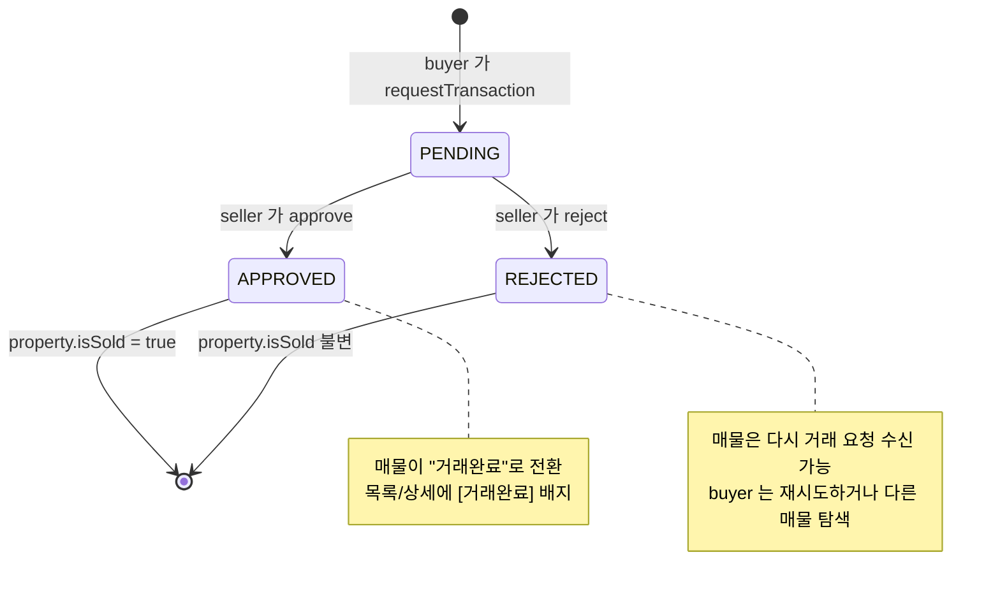
```mermaid
stateDiagram-v2
    [*] --> PENDING : buyer 가 requestTransaction

    PENDING --> APPROVED : seller 가 approve
    PENDING --> REJECTED : seller 가 reject

    APPROVED --> [*] : property.isSold = true
    REJECTED --> [*] : property.isSold 불변

    note right of APPROVED
      매물이 "거래완료"로 전환
      목록/상세에 [거래완료] 배지
    end note

    note right of REJECTED
      매물은 다시 거래 요청 수신 가능
      buyer 는 재시도하거나 다른 매물 탐색
    end note
```

- `PropertyService.approveTransaction` 은 `transaction.setStatus(APPROVED)` + `property.setSold(true)` 를 한 트랜잭션 안에서 수행
- `rejectTransaction` 은 매물에 손대지 않음 (거절은 판매 완료가 아님)

---

## 로드맵

이번 릴리스에서 구현된 것 외에 API 가 준비되어 UI 연결을 기다리는 영역:

| 영역 | 상태 | 다음 액션 |
|:-----|:-----|:----------|
| `additionalOptions` 필터 | 백엔드 JPQL 이 단일 값 비교 구조라 리스트 매칭 미동작 | `findByFilters` 재설계 후 목록 필터 바에 체크박스 연결 |
| 아파트·중개업자 탐색 | 백엔드 준비 완료 | `/apartments`, `/realtors` 페이지 신규 작성 |
| 커뮤니티 게시글 (CRUD · 좋아요 · Top Liked) | 백엔드 준비 완료 | `/posts` 피드 페이지 |
| FAQ 페이지 | 백엔드 준비 완료 | `/faqs` 아코디언 UI |
| 소셜 로그인 | 백엔드 컨트롤러 준비, 네이버 OAuth 시크릿 로테이션 선행 필요 | `/oauth/...` 콜백 플로우 정리 |
| 지도 기반 UI | 현재는 좌표 프리셋 버튼 3종 | Naver Map / Leaflet 임베드 + 범위 드래그 |
| 프론트 JSX → TSX 마이그레이션 | `LoginPage.jsx`, `RegisterPage.jsx` 등 | 타입 정의 후 `allowJs: false` 복귀 |
| 시크릿 히스토리 정리 | `application.properties` 초기 커밋에 네이버 시크릿 노출 이력 존재 | 네이버 콘솔에서 client secret 로테이션 (옵션: `git filter-repo`) |

---

## 팀 정보

| 이름 | 역할 |
|:-----|:-----|
| GEONHO96 | Full-Stack 개발 · 아키텍처 · 리팩터링 |
